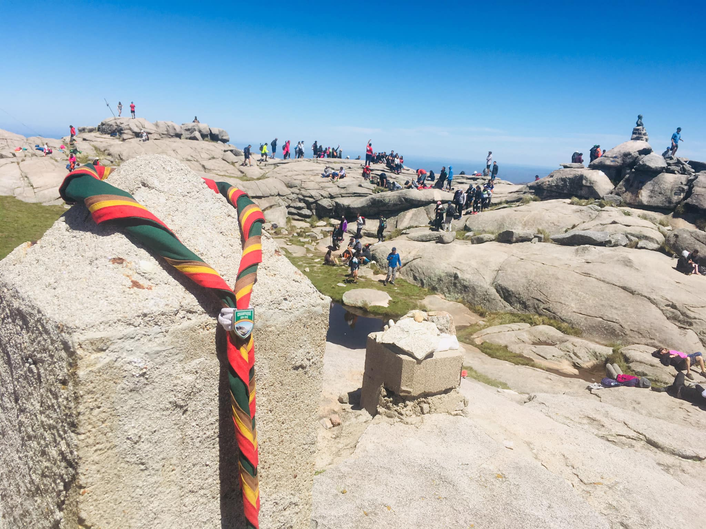

# Grupo Scout "Granaderos de San Martín" N° 506 - Distrito 1 - Zona 22 - Córdoba, Argentina

Este es el sitio web del Grupo Scout "Granaderos de San Martín" N° 506, perteneciente al Distrito 1 de la Zona 22 en Córdoba, Argentina. Este grupo scout tiene una larga trayectoria en la formación de jóvenes en valores como la solidaridad, el respeto por la naturaleza y la responsabilidad, y este sitio web es una herramienta fundamental para la difusión de su labor.

El sitio web ha sido desarrollado utilizando las tecnologías React, Tailwind y daisyUI, lo que garantiza una experiencia de usuario intuitiva y agradable. En él, podrás encontrar información sobre las actividades del grupo, sus eventos, sus proyectos y las formas de contacto para sumarte a su comunidad.

Además, el sitio web cuenta con un diseño moderno y atractivo, que refleja la esencia del grupo scout y su compromiso con la juventud y la sociedad. ¡Explora todas sus secciones y descubre todo lo que el Grupo Scout "Granaderos de San Martín" tiene para ofrecer!

## Tabla de contenidos

  - [Captura de pantalla](#screenshot)
  - [Enlaces de interés](#links)
  - [Construid con](#built-with)
  - [Autor](#author)

## Screenshot

## Enlaces de interés

- Repo: 
- Deploy: 

## Construido con

- HTML5
- CSS3
- Modern JavaScript (ES6+)
- React & ReactDOM: [reactjs.org](https://reactjs.org/)
- Vite.js: [vitejs.dev](https://vitejs.dev/)
- Tailwind: [tailwindcss.com](https://tailwindcss.com/)
- daisyUI: [daisyui.com](https://daisyui.com/)

## Autor

- Github: [github.com/creativoma](https://github.com/creativoma)
- Linkedin: [linkedin.com/in/ma-marianoalvarez](https://www.linkedin.com/in/ma-marianoalvarez/)